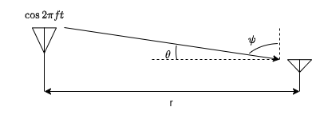
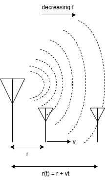
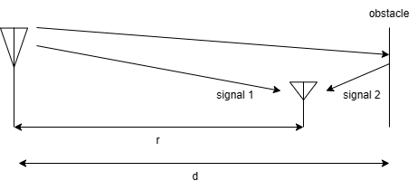

Wireless channel characterizes the interaction of the  transmitted electromagnetic wave with the propogation environment before arriving at the reciever via multipath. 

In response to the transmission of sinusoid  $\cos(2\pi ft)$, the received signal in free space with fixed antenna can be expressed as

$$
\begin{aligned}
    E(f,t,(r,\theta,\psi)) = \frac{\alpha\left(\theta,\psi,f\right)\cos{2\pi f(t-\frac{r}{c})}}{r},
\end{aligned}
$$

where $c$ is the speed of light, and $\alpha$ is the radiation pattern of the transmitting antenna at frequency $f$ in the direction $(\theta,\psi)$ as shown in the figure. It can be observed that as the distance r between transmitting and receiving antennas increases, the electric field (and thus the recieved power) decreases.

### Scenario 1: Free space with moving receive antenna

Let us consider that the receiver is moving away from transmitter with a velocity $v$. As the receiver moves away, the distance between the subsequent wavefronts of the transmitted EM signal observed by receiving antennas  increases. This can be inferred as a decrease in the frequency as shown below.

Hence, the frequency of the received signal appears to be different from the frequency of transmitted signal. This frequency shift is proportional to the relative velocity between the transmitter and receiver and is referred to as the {\em Doppler spread}. The signal received  by the moving antenna in free space at time $t$ can be expressed as

$$
\begin{aligned}
    E(f,t,(r,\theta,\psi)) = \frac{\alpha\left(\theta,\psi,f\right)\cos{2\pi f(t-\frac{r+vt}{c})}}{r+vt}= \frac{\alpha\left(\theta,\psi,f\right)\cos{2\pi f((1-\frac{v}{c})t-\frac{r}{c})}}{r+vt} \nonumber
\end{aligned}
$$

where $r$ is the initial distance, and $r+vt$ is the final distance.

From above expression, the shift in received frequency, i.e. Doppler shift, can be observed to be $-\frac{fv}{c}=\frac{v}{\lambda}$. The $-ve$ sign signifies the drop in frequency as the receiver is moving away from the source. Similarly, $+ve$ shift can be observed when the receiver is moving towards the source. The maximum spread between frequency shifts is called as Doppler spread.

Another closely related concept to understand from Doppler shift is the {\em coherence time} which is the time duration over which the channel impulse response or frequency response remains strongly correlated or predictable. In practical terms, it represents the time scale over which the wireless channel can be considered approximately constant. The coherence time of the channel and the Doppler shift are inversely related. This is because the coherence time dictates how long the channel remains approximately constant, while the Doppler shift affects how rapidly the channel conditions change due to motion. Systems with shorter coherence times require more frequent channel estimation and adaptation to track the rapidly changing channel conditions caused by motion. Conversely, systems with longer coherence times can maintain relatively stable channel estimates for longer duration, requiring less frequent channel estimation and adaption of transmission signal. 

### Scenario 2: Reflecting wall with fixed antenna

Let us now try to understand the effect of obstacles by considering a reflecting wall  as shown in the following figure.

As we can see, this set-up involves the superposition of two signals at the receiving antenna, one received directly from the transmitting antenna and the other one is the reflected back from the obstacle. The received signal in such scenario can  be expressed as

$$
\begin{aligned}
    E(f,t,(r,\theta,\psi)) = \frac{\alpha\left(\theta,\psi,f\right)\cos{2\pi f(t-\frac{r}{c})}}{r} - \frac{\alpha\left(\theta,\psi,f\right)\cos{2\pi f(t-\frac{2d-r}{c})}}{2d-r}.
\end{aligned}
$$

It is important to understand that superposition of these two signals can result in constructive or destructive interference depending on the path delays $\tau_1$ and $\tau_2$ of the arriving multipath signals. 

and the delay spread can be quantified as $\frac{2d-r}{c}-\frac{r}{c}$. This is closely tied to the concept of {\em coherence bandwidth} which refers to the range of frequencies over which the wireless channel response remains correlated or predictable. In practice, a larger delay spread implies a shorter coherence bandwidth and vice versa. Systems with higher delay spread may require more sophisticated equalization techniques to mitigate the effects of interference caused by the spread of signal arrival times.

This gives rise to the concept of {\em delay spread} which is the time difference between the arrival of the first and last significant paths of the transmitted signal at the receiver. 
