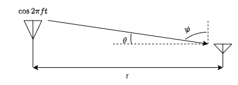
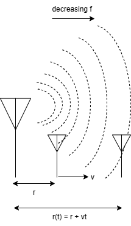
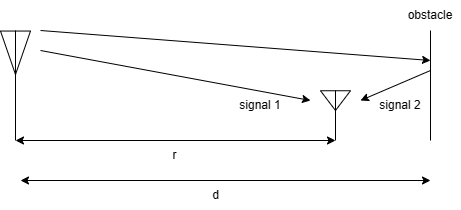

Wireless channels operate through electromagnetic radiation from the transmitter to the receiver.

In practical wireless communication, the received signal is influenced not only by distance but also by **motion, reflections, and environmental geometry**.  
Understanding these physical effects intuitively helps connect mathematical channel models to **real system design considerations** such as reliability, data rate, and coverage.

In response to the transmission of sinusoid  $\cos(2\pi ft)$, the received signal in free space with fixed antenna can be expressed as

$$
E(f,t,(r,\theta,\psi)) = \frac{\alpha\left(\theta,\psi,f\right)\cos{2\pi f(t-\frac{r}{c})}}{r},
$$

where $c$ is the speed of light, and $\alpha$ is the radiation pattern of the transmitting antenna at frequency $f$ in the direction $(\theta,\psi)$ as shown in the figure. It can be observed that as the distance increases, the electric field decreases resulting in the decline of received power with the increase in the distance between transmitting and receiving antennas.

Physically, this decay occurs because electromagnetic energy **spreads over a larger spherical surface** as distance increases, which directly leads to **pathloss** in wireless links.

However, it is not practical to consider that the receiver is always in a fixed position. Thus, let us consider that the receiver is moving away from transmitter with a velocity $v$. As the receiver moves away, the distance between the subsequent wavefronts of the transmitted EM signal observed by receiving antennas increases. This can be inferred as a decrease in the frequency as shown below.

Hence, the frequency of the received signal appears to be different from the frequency of transmitted signal. This frequency shift is proportional to the relative velocity between the transmitter and receiver and is referred to as the "Doppler spread". To understand this change in frequency, we can evaluate the rate of change of phase delay $\triangle\Phi$.

The additional distance $\triangle d$ travelled by the wave due to the reciever motion can be obtained as $\triangle d = \triangle t.v.\cos\theta$. Using this, we can obtain the phase delay as

$$
\triangle\Phi = \frac{2\pi\triangle d}{\lambda} =  \frac{2\pi\triangle v }{\lambda}\cos\theta
$$

Thus, this phase delay gives rise to a frequency shift as

$$
f_D = \frac{1}{2\pi} \frac{\triangle\Phi}{\triangle t} = \frac{v}{\lambda} \cos\theta
$$

This relation provides key intuition:

- **Higher user velocity → larger Doppler shift → faster channel variation**
- **Higher carrier frequency (smaller $\lambda$) → increased Doppler sensitivity**

The signal received by the moving antenna in free space can be expressed as

$$
E(f,t,(r,\theta,\psi)) =
\frac{\alpha\left(\theta,\psi,f\right)\cos{2\pi f((1-\frac{v}{c})t-\frac{r}{c})}}{r+vt}.
$$

From above expression, the Doppler shift is $-\frac{fv}{c}=\frac{v}{\lambda}$, where the negative sign signifies a drop in frequency when the receiver moves away from the source.

Another closely related concept to understand from doppler shift is the "Coherence time" which is the time duration over which the channel impulse response, or frequency response, remains strongly correlated or predictable. In practical terms, it represents the time scale over which the wireless channel can be considered approximately constant. The coherence time of the channel and the Doppler shift are inversely related. This is because the coherence time dictates how long the channel remains approximately constant, while the Doppler shift affects how rapidly the channel conditions change due to motion. Systems with shorter coherence times require more frequent channel estimation and adaptation to track the rapidly changing channel conditions caused by motion. Conversely, systems with longer coherence times can maintain relatively stable channel estimates for longer duration, requiring less frequent channel estimation and adaption of transmission signal.

---

Let us now try to understand the effect of obstacles by considering a reflecting wall.

This scenario involves the superposition of a **direct path** and a **reflected path**, giving rise to **delay spread**, defined as the time difference between the first and last arriving signal components.

This configuration corresponds to the classical **two-ray propagation model**, widely used in cellular system analysis because it captures the dominant behavior of **ground reflection and line-of-sight propagation**.

The received signal is

$$
E(f,t,(r,\theta,\psi)) = \frac{\alpha\cos{2\pi f(t-\frac{r}{c})}}{r} -\frac{\alpha\cos{2\pi f(t-\frac{2d-r}{c})}}{2d-r}.
$$

The phase difference between the two paths is

$$
\triangle\Theta = \frac{4\pi f}{c}(d-r) + \pi.
$$

Constructive interference occurs when $\triangle\Theta$ is a multiple of $2\pi$, and destructive interference occurs at odd multiples of $\pi$, producing spatial fading patterns.

The delay spread is

$$
T_d = \frac{2d-r}{c} - \frac{r}{c}.
$$

The coherence bandwidth is

$$
B_C = \frac{1}{T_d}.
$$

A larger delay spread implies **frequency-selective fading**, requiring **equalization or multicarrier modulation (e.g., OFDM)**, whereas small delay spread leads to **flat fading channels** that are simpler to handle.

---

Wireless channel modeling therefore captures **time variation (Doppler), frequency selectivity (delay spread), and large-scale decay (two-ray breakpoint behavior)**.

Together, these parameters determine:

- **Channel estimation rate** → governed by Doppler and coherence time  
- **Equalization complexity** → governed by delay spread and coherence bandwidth  
- **Cell coverage limits** → governed by pathloss and breakpoint distance  

Hence, understanding these effects is essential for designing **reliable, high-performance wireless communication systems in realistic environments**.

### Summary of Channel Parameters and System Impact

| Parameter | Physical Meaning | Impact on System Design |
|-----------|------------------|--------------------------|
| Doppler shift $f_D$ | Rate of frequency change due to motion | Determines channel estimation speed |
| Coherence time $T_c$ | Time duration of channel stability | Guides pilot spacing in time |
| Delay spread $T_d$ | Spread of multipath arrival times | Causes intersymbol interference |
| Coherence bandwidth $B_c$ | Frequency range with similar fading | Determines flat vs frequency-selective fading |
| Breakpoint distance $d_{bp}$ | Transition from $1/r^2$ to $1/r^4$ decay | Governs practical cell radius |

Together, these parameters provide a **complete time-frequency characterization** of wireless channels and form the basis for **robust communication system design**.

